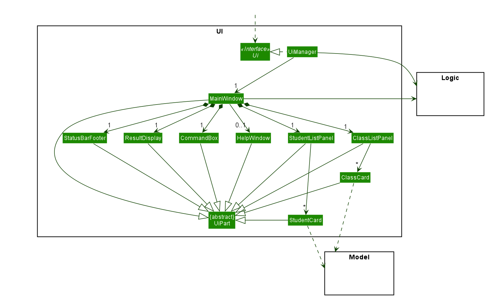
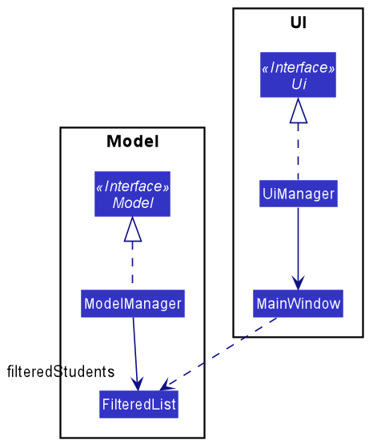
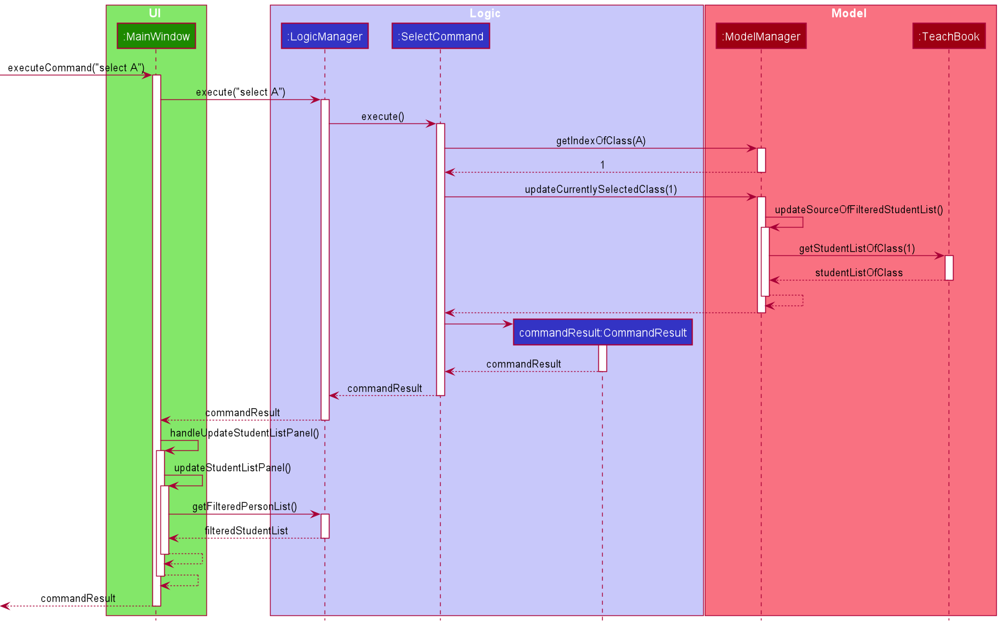
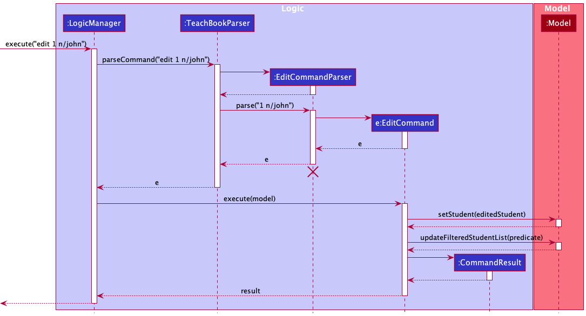
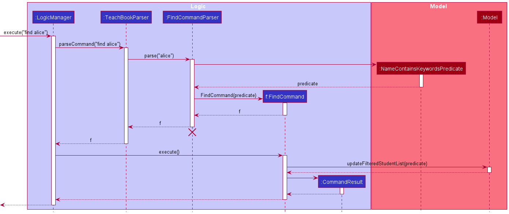
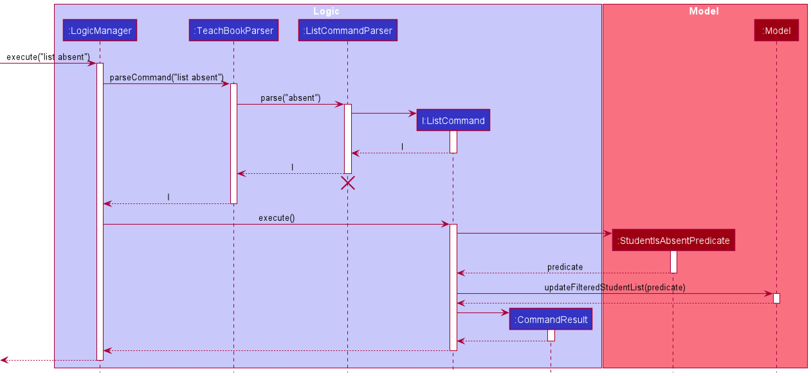
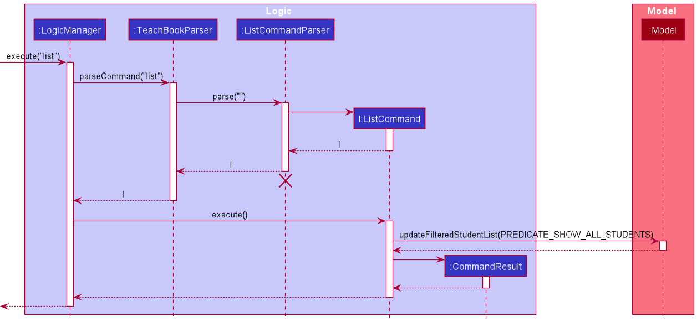
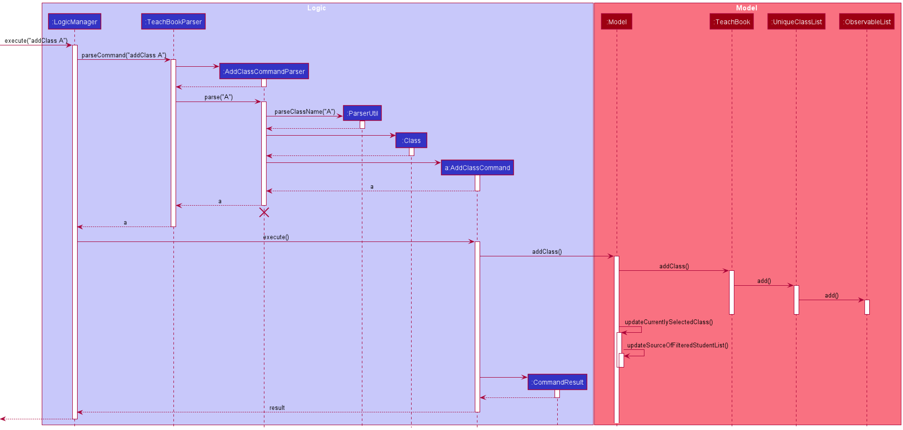
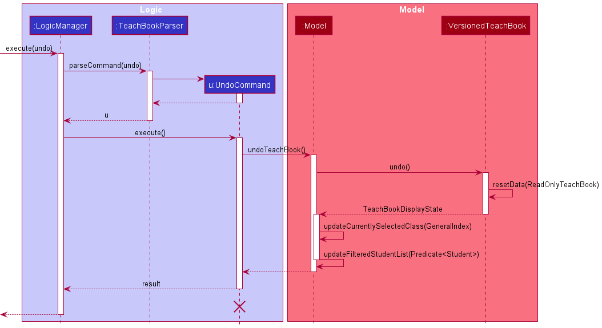
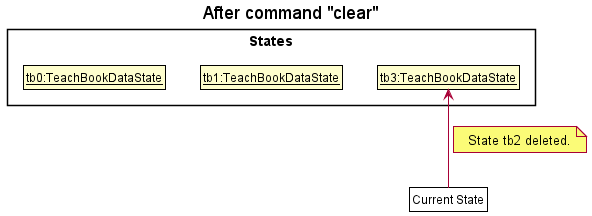

* Table of Contents
{:toc}

--------------------------------------------------------------------------------------------------------------------

## **Acknowledgements**

* The logic of `undo` and `redo` features is adapted from [AB4](https://github.com/se-edu/addressbook-level4).
* The `print` feature uses third-party library [Apache POI](https://poi.apache.org/).

--------------------------------------------------------------------------------------------------------------------

## **Setting up, getting started**

Refer to the guide [_Setting up and getting started_](SettingUp.md).

--------------------------------------------------------------------------------------------------------------------

## **Design**

:bulb: **Tip:** The `.puml` files used to create diagrams in this document can be found in the [diagrams](https://github.com/AY2122S1-CS2103T-W10-2/tp/tree/master/docs/diagrams) folder. Refer to the [_PlantUML Tutorial_ at se-edu/guides](https://se-education.org/guides/tutorials/plantUml.html) to learn how to create and edit diagrams.

### Architecture

The ***Architecture Diagram*** given above explains the high-level design of the App.

Given below is a quick overview of main components and how they interact with each other.

**Main components of the architecture**

**`Main`** has two classes called [`Main`](https://github.com/AY2122S1-CS2103T-W10-2/tp/blob/master/src/main/java/seedu/teachbook/Main.java) and [`MainApp`](https://github.com/AY2122S1-CS2103T-W10-2/tp/blob/master/src/main/java/seedu/teachbook/MainApp.java). It is responsible for,
* At app launch: Initializes the components in the correct sequence, and connects them up with each other.
* At shut down: Shuts down the components and invokes cleanup methods where necessary.

[**`Commons`**](#common-classes) represents a collection of classes used by multiple other components.

The rest of the App consists of four components.

* [**`UI`**](#ui-component): The UI of the App.
* [**`Logic`**](#logic-component): The command executor.
* [**`Model`**](#model-component): Holds the data of the App in memory.
* [**`Storage`**](#storage-component): Reads data from, and writes data to, the hard disk.

**How the architecture components interact with each other**

The Sequence Diagram below shows how the components interact with each other for the scenario where the user issues the command `delete 1`.

Each of the four main components (also shown in the diagram above),

* defines its API in an `interface` with the same name as the Component.
* implements its functionality using a concrete `{Component Name}Manager` class (which follows the corresponding API `interface` mentioned in the previous point.

For example, the `Logic` component defines its API in the `Logic.java` interface and implements its functionality using the `LogicManager.java` class which follows the `Logic` interface. Other components interact with a given component through its interface rather than the concrete class (reason: to prevent outside component's being coupled to the implementation of a component), as illustrated in the (partial) class diagram below.

The sections below give more details of each component.

### UI component

The **API** of this component is specified in [`Ui.java`](https://github.com/AY2122S1-CS2103T-W10-2/tp/blob/master/src/main/java/seedu/teachbook/ui/Ui.java)

The UI consists of a `MainWindow` that is made up of parts e.g.`CommandBox`, `ResultDisplay`, `StudentListPanel`, `ClassListPanel`, `StatusBarFooter` etc. All these, including the `MainWindow`, inherit from the abstract `UiPart` class which captures the commonalities between classes that represent parts of the visible GUI.
The `ClassCard` will be displayed by the `ClassListPanel` and the `StudentCard` will be displayed by the `StudentListPanel`. 

The `UI` component uses the JavaFX UI framework. The layout of these UI parts are defined in matching `.fxml` files that are in the `src/main/resources/view` folder. For example, the layout of the [`MainWindow`](https://github.com/AY2122S1-CS2103T-W10-2/tp/blob/master/src/main/java/seedu/teachbook/ui/MainWindow.java) is specified in [`MainWindow.fxml`](https://github.com/AY2122S1-CS2103T-W10-2/tp/blob/master/src/main/resources/view/MainWindow.fxml)

The `UI` component,

* executes user commands using the `Logic` component.
* listens for changes to `Model` data so that the UI can be updated with the modified data.
* keeps a reference to the `Logic` component, because the `UI` relies on the `Logic` to execute commands.
* depends on some classes in the `Model` component, as it displays `Student` and `Class` object residing in the `Model`.

### Logic component

**API** : [`Logic.java`](https://github.com/AY2122S1-CS2103T-W10-2/tp/blob/master/src/main/java/seedu/teachbook/logic/Logic.java)

Here's a (partial) class diagram of the `Logic` component:

How the `Logic` component works:
1. When `Logic` is called upon to execute a command, it uses the `TeachBookParser` class to parse the user command.
1. This results in a `Command` object (more precisely, an object of one of its subclasses e.g., `AddCommand`) which is executed by the `LogicManager`.
1. The command can communicate with the `Model` when it is executed (e.g. to add a student).
1. The result of the command execution is encapsulated as a `CommandResult` object which is returned from `Logic`.

The Sequence Diagram below illustrates the interactions within the `Logic` component for the `execute("delete 1")` API call.

:information_source: **Note:** The lifeline for `DeleteCommandParser` should end at the destroy marker (X) but due to a limitation of PlantUML, the lifeline reaches the end of diagram.

Here are the other classes in `Logic` (omitted from the class diagram above) that are used for parsing a user command:

How the parsing works:
* When called upon to parse a user command, the `TeachBookParser` class creates an `XYZCommandParser` (`XYZ` is a placeholder for the specific command name e.g., `AddCommandParser`) which uses the other classes shown above to parse the user command and create a `XYZCommand` object (e.g., `AddCommand`) which the `TeachBookParser` returns back as a `Command` object.
* All `XYZCommandParser` classes (e.g., `AddCommandParser`, `DeleteCommandParser`, ...) inherit from the `Parser` interface so that they can be treated similarly where possible e.g, during testing.

### Model component
**API** : [`Model.java`](https://github.com/AY2122S1-CS2103T-W10-2/tp/blob/master/src/main/java/seedu/teachbook/model/Model.java)

The `Model` component,

* stores TeachBook data i.e., all `Student` objects (which are contained in a `UniqueStudentList` object).
* stores the currently 'selected' `Student` objects (e.g., results of a search query) as a separate _filtered_ list which is exposed to outsiders as an unmodifiable `ObservableList<Student>` that can be 'observed' e.g. the UI can be bound to this list so that the UI automatically updates when the data in the list change.
* stores a `UserPref` object that represents the user’s preferences. This is exposed to the outside as a `ReadOnlyUserPref` objects.
* does not depend on any of the other three components (as the `Model` represents data entities of the domain, they should make sense on their own without depending on other components)

:information_source: **Note:** An alternative (arguably, a more OOP) model is given below. It has a `Tag` list in the `TeachBook`, which `Student` references. This allows `TeachBook` to only require one `Tag` object per unique tag, instead of each `Student` needing their own `Tag` objects. 

### Storage component

**API** : [`Storage.java`](https://github.com/AY2122S1-CS2103T-W10-2/tp/blob/master/src/main/java/seedu/teachbook/storage/Storage.java)

The `Storage` component,
* can save both TeachBook data and user preference data in json format, and read them back into corresponding objects.
* inherits from both `TeachBookStorage` and `UserPrefStorage`, which means it can be treated as either one (if only the functionality of one is needed).
* depends on some classes in the `Model` component (because the `Storage` component's job is to save/retrieve objects that belong to the `Model`)

### Common classes

Classes used by multiple components are in the `seedu.teachbook.commons` package.

--------------------------------------------------------------------------------------------------------------------

## **Implementation**

This section describes some noteworthy details on how certain features are implemented.

### Integration of class feature

#### Design considerations

**Aspect: Structure of the new model component**

To integrate the new class feature into the existing AB3 product, we decided that each student object should have a reference to its class, and there should only be one class object for the same class. We considered and compared a few designs of the rest of the model component:

* **Alternative 1 (current choice):** `TeachBook` maintains a list of all classes. Each class maintains a list of all students in that class. A unique student list containing all students in all classes is generated every time when users execute the `list all` command.
  * Pros
    * When adding/deleting students, we only need to add/delete ONCE using a class's student list at most times.
    * The filtered student list inside `ModelManager` can take the student list of the currently selected class as its source directly.
  * Cons
    * When `list all`, we need to construct the unique student list by iterating through each class's student list, which can degrade the performance of the `list all` command.

* **Alternative 2:** `TeachBook` maintains a list of all classes. Each class maintains a list of all students in that class. `TeachBook` also maintains a unique student list containing all students in all classes.
  * Pros
    * The filtered student list inside `ModelManager` can still take the student list of the currently selected class as its source directly.
    * When `list all`, the filtered student list can also take the maintained unique student list as its source directly.
  * Cons
    * When adding/deleting students, we always need to add/delete TWICE. This means we need to modify both a class's student list and the unique student list.
    * If we simply add/delete students of the unique student list without maintaining a specific order of all the students, the list can look messy when `list all`. We may still need to do a sorting by class when `list all`, which actually also degrades the performance of `list all`.

* **Alternative 3:** `TeachBook` only maintains a unique student list containing all students in all classes.
  * Pros
    * Easiest to implement and most components can be reused from AB3.
    * When adding/deleting students, we only need to add/delete ONCE using the unique student list.
  * Cons
    * Similar to _Alternative 2_, there is still the need to maintain the order of students in the unique student list.
    * We always need a predicate to screen out students of the currently selected class. Since users may interact with a specific class at most times, this can degrade the performance of most commands.

### Synchronization of Student List in Model and UI

To ensure synchronization throughout the program, `ModelManager` maintains a `filteredStudents` observable, which is 
observed by `MainWindow`. `filteredStudents` contains the list of students to be displayed in the UI.

`SelectCommand` and `ListCommand` with the `all` option i.e., `list all` are the only two commands that will modify the
`filteredStudents` entirely, i.e., a new observable is created and replaces the existing observable, via 
`ModelManager#updateSourceOfFilteredStudentList()`. However, this change is not observed by `MainWindow` as `MainWindow`
only observes changes within the observable, i.e., the previous `filteredStudents` observable, and not the changes to
the `filteredStudents` variable itself, which contains the observable. To mitigate this issue, the 
`updateStudentListPanel` flag, in the `commandResult` returned after the execution of both `SelectCommand` and 
`ListCommand` with the `all` option, is set to `true`. The flag then triggers the `MainWindow` to retrieve the new 
`filteredStudents` observable via the `MainWindow#updateStudentListPannel()` and start observing changes in the new 
observable. Thereafter, the student list in the UI is again in sync with the student list in the Model.

Below is the sequence diagram of the execution of the `SelectCommand`.

Below is the sequence diagram of the execution of the `ListCommand` with the `all` option.

### Delete class feature

#### Implementation

The delete class feature allows users to delete a class and all students in the class from the TeachBook. This feature is facilitated by `DeleteClassCommand` and `DeleteClassCommandParser`.

Given below is an example usage scenario and how the delete class mechanism behaves.

The following object diagram shows an example initial state of the TeachBook:

The following sequence diagram shows interactions within the `Logic` component and part of the `Model` component for the `deleteClass B` command:

The following object diagram shows the updated TeachBook:

### Edit feature

TeachBook allows users to edit students' details after initially adding the students. However, 
a student's class cannot be modified.

#### Implementation details

The edit command is implemented using EditCommand and EditCommandParser, along with TeachBookParser
and LogicManager which creates the required objects. Cases where the user enters an invalid input or
does not modify the student at all is handled with exceptions along with corresponding error feedback
to the user.

The edit command has the following format:
`edit INDEX [n/NAME] [p/PHONE_NUMBER] [e/EMAIL] [a/ADDRESS] [t/TAG]...`

Given below is the sequence diagram on how EditCommand behaves in TeachBook when the user tries to edit 
the student's name at index 1 of the current class to john

Given below is the activity diagram for the same scenario above

### Filtering

Filtering is an essential feature to have when it comes to an application that stores data. This is because with 
filtering, users can access information with ease in the shortest time possible.

With reference to the discussion on 
[*Synchronization of Student List in Model and UI*](#synchronization-of-student-list-in-model-and-ui) earlier, 
at any point of time, `filteredStudents` will contain either the list of all students from the currently 
selected class or the list of all students from all classes. By making `filteredStudents` a `FilteredList<Student>`,
filtering can be done easily to both the list of all students from a class and the list of all students from all classes
by just passing in the corresponding `Predicate<Student>`. For example, `FindCommand` and `ListCommand` with the 
`absent` option filter the `filteredStudents` via `ModelManager#updateFilteredStudentList()` by passing in the 
`NameContainsKeywordsPredicate` and `StudentIsAbsentPredicate` respectively. To "clear" the filter on the other hand, 
there is the `ListCommand` which utilizes the `ModelManager#updateFilteredStudentList()` as well but passing in
`PREDICATE_SHOW_ALL_STUDENTS` instead. Note that because filtering is done on the `filteredStudent` observable, the 
changes will be observed by the `MainWindow` and the result of filtering will be reflected immediately in the UI.

Below is the sequence diagram of the execution of the `FindCommand`.

Below is the sequence diagram of the execution of the `ListCommand` with the `absent` option.

Below is the sequence diagram of the execution of the `ListCommand`.

### Add class feature

TeachBook allows users to add classes.

#### Implementation details

The addClass command is implemented using multiple classes. Firstly, when the user input `addClass A`, the LogicManager
will invoke the parseCommand of TeachBookParser to create a addClassCommandParse object. The parse method in 
the AddClassCommandParser will be called to parse the inputs. It will create a class object named `A` and then return a
`addClassCommand` object. The returned `addClassCommand` then runs the `execute()` method which will in turn invoke the chain of
`addClass()`, `addClass()`, `add()` and `add()` command by the `model`, `TeachBook`, `UniqueClassList` and `ObservableList` classes
respectively.

The addClass command has the following format:
`addClass CLASS_NAME`

Given below is the sequence diagram on how addClass Command behaves in TeachBook when the user tries to add a class
named `A`.

### Undo/redo feature

#### Implementation

The undo/redo mechanism is facilitated by `VersionedTeachBook`. It extends `TeachBook` with an undo/redo history, each state is stored internally as an `TeachbookDataState` which consist of a `TeachBook` and `TeachbookDisplayState`. `TeachbookDisplayState` stored the filter predicate for the student list if any is applied and also the index of the selected class to be displayed.
The `TeachbookDataState` is stored in a `TeachbookStateList` with a `currentStatePointer`. Additionally, it implements the following operations:

* `VersionedTeachBook#commit()` — Saves the current TeachBook state in its history.
* `VersionedTeachBook#undo()` — Restores the previous TeachBook state from its history.
* `VersionedTeachBook#redo()` — Restores a previously undone TeachBook state from its history.

These operations are exposed in the `Model` interface as `Model#commitTeachBook()`, `Model#undoTeachBook()` and `Model#redoTeachBook()` respectively.

`Model#undoTeachBook()` and `Model#redoTeachBook()` will return display settings to update the model accordingly.

Given below is an example usage scenario and how the undo/redo mechanism behaves at each step.

Step 1. The user launches the application for the first time. The `VersionedTeachBook` will be initialized with the initial TeachbookDataState, and the `currentStatePointer` pointing to that single TeachBook state.

Step 2. The user executes `delete 5` command to delete the 5th student in the Teachbook. The `delete` command calls `Model#commitTeachBook()`, causing the modified TeachbookDatastate after the `delete 5` command executes to be saved in the `teachBookStateList`, and the `currentStatePointer` is shifted to the newly inserted TeachBook state.

Step 3. The user executes `add n/David ...` to add a new student. The `add` command also calls `Model#commitTeachBook()`, causing another modified TeachbookDatastate to be saved into the `teachBookStateList`.

:information_source: **Note:** If a command fails its execution, it will not call `Model#commitTeachBook()`, so the TeachBook state will not be saved into the `teachBookStateList`.

Step 4. The user now decides that adding the student was a mistake, and decides to undo that action by executing the `undo` command. The `undo` command will call `Model#undoTeachBook()`, which will shift the `currentStatePointer` once to the left, pointing it to the previous TeachBook state, and restores the Teachbook to that state.

:information_source: **Note:** If the `currentStatePointer` is at index 0, pointing to the initial TeachBook state, then there are no previous TeachBook states to restore. The `undo` command uses `Model#canUndoTeachBook()` to check if this is the case. If so, it will return an error to the user rather
than attempting to perform the undo.

The following sequence diagram shows how the undo operation works:

:information_source: **Note:** The lifeline for `UndoCommand` should end at the destroy marker (X) but due to a limitation of PlantUML, the lifeline reaches the end of diagram.

The `redo` command does the opposite — it calls `Model#redoTeachBook()`, which shifts the `currentStatePointer` once to the right, pointing to the previously undone state, and restores the TeachBook to that state.

:information_source: **Note:** If the `currentStatePointer` is at index `teachBookStateList.size() - 1`, pointing to the latest TeachBook state, then there are no undone TeachBook states to restore. The `redo` command uses `Model#canRedoTeachBook()` to check if this is the case. If so, it will return an error to the user rather than attempting to perform the redo.

Step 5. The user then decides to execute the command `list`. Commands that do not modify the TeachBook, such as `list`, will usually not call `Model#commitTeachBook()`, `Model#undoTeachBook()` or `Model#redoTeachBook()`. Thus, the `teachBookStateList` remains unchanged.

Step 6. The user executes `clear`, which calls `Model#commitTeachBook()`. Since the `currentStatePointer` is not pointing at the end of the `teachBookStateList`, all TeachBook states after the `currentStatePointer` will be purged. Reason: It no longer makes sense to redo the `add n/David ...` command. This is the behavior that most modern desktop applications follow.

The following activity diagram summarizes what happens when a user executes a new command:

#### Design considerations

**Aspect: How undo & redo executes:**

* **Alternative 1 (choice):** Saves the entire TeachBook.
  * Pros: Easy to implement.
  * Cons: May have performance issues in terms of memory usage.

* **Alternative 2:** Individual command knows how to undo/redo by
  itself.
  * Pros: Will use less memory (e.g. for `delete`, just save the student being deleted).
  * Cons: We must ensure that the implementation of each individual command are correct.
  

--------------------------------------------------------------------------------------------------------------------

## **Documentation, logging, testing, configuration, dev-ops**

* [Documentation guide](Documentation.md)
* [Testing guide](Testing.md)
* [Logging guide](Logging.md)
* [Configuration guide](Configuration.md)
* [DevOps guide](DevOps.md)

--------------------------------------------------------------------------------------------------------------------

## **Appendix: Requirements**

### Product scope

**Target user profile**:

* is a primary or secondary school teacher
* has a need to manage multiple class worth of student's contacts that she is teaching
* prefers desktop apps over other types
* is not proficient in IT but can type fast
* prefers typing to mouse interactions
* is reasonably comfortable using CLI apps
* wants to keep her personal contacts and students' contacts separate
* wants to better take care of her students by storing some special notes (e.g. allergy condition) of her students somewhere
* wants to have an app to help with administrative work in teaching (e.g. taking attendance, keying in grades of students)

**Value proposition**: manage contacts faster than a typical mouse/GUI driven app. Allows teachers to have a dedicated app to keep their work life separated from their personal life. Allows teacher to find students and their emergency information accurately and easily.

### User stories

Priorities: High (must have) - `* * *` , Medium (nice to have) - `* *` , Low (unlikely to have) - `*`

| Priority | As a ...                                                  | I want to ...                                                                                   | So that I can ...                                                                        |
| -------- | --------------------------------------------------------- | ----------------------------------------------------------------------------------------------- | ---------------------------------------------------------------------------------------- |
| `* * *` | new user | get instructions | refer to instructions when I forget how to use the TeachBook |
| `* * *` | teacher | add the students I teach |  |
| `* * *` | teacher | remove students from my contacts | remove specific students who are no longer take my classes |
| `* * *` | teacher | search for my students in my contacts by name | get a student's information easily  |
| `* * *` | teacher | view my student's information | contact them easily |
| `* * *` | teacher | separate my students by classes | better sort my contacts & not mix up students with similar names but from different classes |
| `* *` | teacher | modify contacts | change information easily rather than creating a new contact to replace the previous one |
| `* *` | teacher with students whom require special attention | add important information about my students such as diet, allergies or health conditions | quickly react to any emergency related to these information |
| `* *` | teacher | set a special grading system | customize my grading system just in case it changes in the future |
| `* *` | teacher | reset the grading system | remove any outdated grading system |
| `* *` | teacher | easily store the grades of my students | remember how well each student is doing in my classes |
| `* *` | teacher | sort my students by grade | quickly find out groups of students which require more help |
| `* *` | teacher | set a special grading system | customize my grading system just in case it changes in the future |
| `* *` | teacher | delete a class with its data all at once | quickly remove the class I have stopped teaching |
| `* *` | teacher | clear the TeachBook data all at once | get a fresh TeachBook at the start of the year  |
| `* *` | teacher | filter my students using keywords | quickly list out specific students |
| `* *` | teacher | undo the most recent command | revert any mistakes I make quickly |
| `* *` | teacher | redo the most recent undo | redo any accidental undos |
| `* *` | teacher | view the number of students in each class | prepare sufficient material for each class |
| `* *` | teacher | mark attendance for my students | remember if they attended my classes |
| `* *` | teacher | mark attendance for all my students | quickly mark attendance if all students are present |
| `* *` | teacher | mark students as absent | correct any attendance mistakes |
| `* *` | teacher | mark all students as absent | start marking attendance at the start of the day |
| `*` | teacher | modify class names | edit the class name in case of mistakes |
| `*` | teacher | set special tags for my students | tag my students with extra information |
| `*` | teacher | print out a list of students only containing names | do any administrative work that requires a hard copy document |
| `*` | teacher | print out a list of students with extra information related to the students | do not have to manually input all the information |
| `*` | teacher | view the list of all students | have an overview of all my students |
| `*` | teacher | add all students from a class at once | quickly add the information of the students in each class |
| `*` | teacher | archive my TeachBook data | start over with a clean slate and can retrieve records I need in the future |
| `*` | teacher | able to load a different TeachBook data to my TeachBook  | easily transfer any data from one device to another |

### Use cases

(For all use cases below, the **System** is the `TeachBook` and the **Actor** is the `user`, unless specified otherwise)

**Use case: UC01 - Add class**

MSS:

1. User requests to add a class.
2. TeachBook adds the class.

   Use case ends.

Extensions:

* 1a. Class name is not provided.
    * 1a1. TeachBook shows an error message.

      Use case ends.

* 1b. The given class name is invalid.
    * 1b1. TeachBook shows an error message.

      Use case ends.

* 1c. There is an existing class with the given class name.
    * 1c1. TeachBook shows an error message.

      Use case ends.

**Use case: UC02 - Delete class**

MSS:

1. User requests to delete a class.
2. TeachBook deletes the class.

   Use case ends.

Extensions:

* 1a. Class name is not provided.
    * 1a1. TeachBook shows an error message.

      Use case ends.

* 1b. The specified class does not exist.
    * 1b1. TeachBook shows an error message.
    
      Use case ends.

**Use case: UC03 - Edit class name**

MSS:

1. User requests to edit the name of the currently selected class.
2. TeachBook edits the class name.

   Use case ends.

Extensions:

* 1a. There is no currently selected class.
    * 1a1. TeachBook shows an error message.
      
      Use case ends.

* 1b. No new class name is provided.
    * 1b1. TeachBook shows an error message.
      
      Use case ends.

* 1c. The given new class name is invalid.
    * 1c1. TeachBook shows an error message.

      Use case ends.

* 1d. There is an existing class with the given new class name.
    * 1d1. TeachBook shows an error message.

      Use case ends.

**Use case: UC04 - Select a class**

MSS:

1. User requests to select a class. 
2. TeachBook selects the class.

   Use case ends.

Extensions:

* 2a. The specified class does not exist.
    * 2a1. TeachBook shows an error message.

      Use case ends. 

* 2b. The specified class is already selected.
    * 2b1. TeachBook shows an error message.

      Use case ends. 

**Use case: UC05 - Add student**

MSS:

1. User requests to add a student.
2. TeachBook adds the student.

   Use case ends.

Extensions:

* 1a. There is no currently selected class.
  * 1a1. TeachBook shows an error message.
  
    Use case ends.

* 1b. Student name is not provided.
  * 1b1. TeachBook shows an error message.

    Use case ends.

* 1c. There is an existing student with the same name.
    * 1c1. TeachBook shows an error message.

      Use case ends.

* 1d. Invalid input parameters.
    * 1d1. TeachBook shows an error message.

      Use case ends.

**Use case: UC06 - Delete one or more students**

MSS:

1. User requests to delete one or more specific students.
2. TeachBook deletes the students.

   Use case ends.

Extensions:

* 1a. One or more specified students do not exist.
    * 1a1. TeachBook shows an error message.

      Use case ends.

**Use case: UC07 - Delete all the students in the filtered student list**

MSS:

1. User requests to delete all the students in the filtered student list.
2. TeachBook deletes the students.

   Use case ends.

Extensions:

* 1a. The filtered student list is empty.
    * 1a1. TeachBook shows an error message.

      Use case ends.

**Use case: UC08 - Edit student**

MSS:

1. User requests to edit a student.
2. TeachBook edits the student.

   Use case ends.

Extensions:

* 1a. The specified student does not exist.
    * 1a1. TeachBook shows an error message.
      
      Use case ends.

* 1b. No fields are provided.
    * 1b1. TeachBook shows an error message.
      
      Use case ends.

* 1c. There is an existing student with the given new student name.
    * 1c1. TeachBook shows an error message.

      Use case ends.

* 1d. Invalid input parameters.
    * 1d1. TeachBook shows an error message.

      Use case ends.

**Use case: UC09 - Give remark to a student**

MSS:

1. User requests to give a remark to a specific student.
2. TeachBook overwrites any existing remark of the student with the given remark.

   Use case ends.

Extensions:

* 1a. The specified student does not exist.
    * 1a1. TeachBook shows an error message.

      Use case ends.

* 1b. The given remark is empty.
    * 1b1. TeachBook clears any existing remark of the student.

      Use case ends.

**Use case: UC10 - Find students by one or more keywords**

MSS:

1. User requests to find students by one or more keywords.
2. TeachBook shows a list of students whose name contains at least one of the keywords.

   Use case ends.

**Use case: UC11 - View all students from the currently selected class**

Precondition: There exists a currently selected class

MSS:

1. User requests to view all students from the currently selected class. 
2. TeachBook shows a list of all students from the currently selected class. 

   Use case ends.

**Use case: UC12 - View all students from a class**

MSS:

1. User requests to <ins>select a class (UC04)<ins>.
2. User requests to <ins>view all students from the currently selected class (UC11)<ins>.

   Use case ends.

**Use case: UC13 - View students from all classes**

MSS:

1. User requests to view students from all classes.
2. TeachBook shows a list of students from all classes.

   Use case ends.

**Use case: UC14 - View absent students from a class**

MSS:

1. User requests to <ins>select a class (UC04)<ins>.
2. User requests to view absent students from the class.
3. TeachBook shows a list of absent students from the class.

   Use case ends.

**Use case: UC15 - View absent students from all classes**

MSS:

1. User requests to <ins>view students from all classes (UC13)<ins>.
2. User requests to view absent students from all classes.
3. TeachBook shows a list of absent students from all classes.

   Use case ends.

**Use case: UC16 - Clear filter**

Precondition: A filter is applied to the student list.

MSS:

1. User requests to clear the filter applied to the student list.
2. TeachBook shows the list of all students.

   Use case ends.

**Use case: UC17 - Mark one or more students as present**

MSS:

1. User requests to mark one or more students as present.
2. TeachBook shows the student(s) with their attendance marked.

   Use case ends.

Extensions:

* 1a. At least one of the specified students does not exist.
    * 1a1. TeachBook shows an error message.

      Use case ends.

**Use case: UC18 - Mark all students as present**

MSS:

1. User requests to mark all students as present.
2. TeachBook shows all students with their attendance marked.

   Use case ends.

**Use case: UC19 - Mark one or more students as absent**

MSS:

1. User requests to mark one or more students as absent.
2. TeachBook shows the student(s) with their attendance unmarked.

   Use case ends.

Extensions:

* 1a. At least one of the specified students does not exist.
    * 1a1. TeachBook shows an error message.

      Use case ends.

**Use case: UC20 - Mark all students as absent**

MSS:

1. User requests to mark all students as absent.
2. TeachBook shows all students with their attendance unmarked.

   Use case ends.

**Use case: UC21 - Set a grading system**

MSS:
1. User requests to set a grading system.

[comment]: <> (2. User enters a list of grades for the grading system)
2. TeachBook sets the grading system.
   
   Use case ends.

Extensions:

* 2a.  TeachBook detects that a grading system is already present in TeachBook
  * 2a1. TeachBook shows an error message.
  
    Use case ends.

[comment]: <> (    2a1. TeachBook requests user to delete existing grading system before setting a new one.)

[comment]: <> (    2a2. User resets grading system &#40;UC02&#41;)

[comment]: <> (    Use case resumes from step 2.)

* 2b. TeachBook detects that the command format is invalid.
  * 2b1. TeachBook shows an error message.

    Use case ends.

[comment]: <> (    2b1. TeachBook requests user to follow the correct format.)

[comment]: <> (    Use case resumes from step 2.)

**Use case: UC22 - Reset grading system**

MSS:
1. User requests to reset the existing grading system.
2. TeachBook resets the grading system.

Extensions:
* 2a. TeachBook detects that there is no grading system present in TeachBook.
  * 2a1. TeachBook shows an error message.

    Use case ends.

* 2b. TeachBook detects that the command format is invalid.
  * 2b1. TeachBook shows an error message.

    Use case ends.

**Use case: UC23 - Grade a student**

MSS:
1. User requests to grade a specific student.
2. TeachBook grades the specified student.

Extensions:
2a. TeachBook detects that no grading system is present in TeachBook.

[comment]: <> (    2a1. TeachBook prompts user to set a grading system)

[comment]: <> (    2a2. User sets a new grading system &#40;UC01&#41;)

[comment]: <> (    Use case resumes from step 2.)
* 2a1. TeachBook shows an error message.

  Use case ends.

2b. TeachBook detects that the specified grade is invalid.

[comment]: <> (    2b1. TeachBook informs user that the grade is invalid and displays the current grading system.)

[comment]: <> (    Use case resumes from step 2.)

* 2b1. TeachBook shows an error message.

  Use case ends.

2c. TeachBook detects that the command format is invalid.

[comment]: <> (    2c1. TeachBook requests user to follow the correct format.)

[comment]: <> (    Use case resumes from step 2.)

* 2c1. TeachBook shows an error message.

  Use case ends.

**Use case: UC24 - Sort students according to grade**

MSS:
1. User requests to sort the students according to their grade.
3. TeachBook sorts the students according to their grade specified by the grading system.
   Use case ends.

Extension:

2a. TeachBook detects that no grading system is present in TeachBook.

[comment]: <> (    2a1. TeachBook prompts user to set a grading system)

[comment]: <> (    2a2. User sets a new grading system &#40;UC01&#41;)

[comment]: <> (    Use case resumes from step 2.)

* 2a1. TeachBook shows an error message.

  Use case ends.

2b. TeachBook detects that the command format is invalid.

[comment]: <> (    2b1. TeachBook requests user to follow the correct format.)

[comment]: <> (    Use case resumes from step 2.)

* 2b1. TeachBook shows an error message.

  Use case ends.

**Use case: UC25 - Sort students according to name**

MSS:
1. User requests to sort the students according to their name.
2. TeachBook sorts the students according to their name in alphabetical order.

2a. TeachBook detects that the command format is invalid.

* 2a1. TeachBook shows an error message.

  Use case ends.

**Use case: UC26 - Print out list of student**

Preconditions: There exists a currently selected class.

MSS:

1. User request to get an Excel sheet of students for currently selected class.
2. TeachBook generate the Excel sheet.

   Use case ends.

Extensions:

* 1a. Teacher does not have Excel on the device.
    * 2a1. TeachBook shows an error message.

      Use case ends.

* 1b. User does not have a downloads folder on the device.
    * 1b1. TeachBook shows an error message.

      Use case ends.

**Use case: UC27 - Print out list of student with additional columns**

Preconditions: There exists a currently selected class.

MSS:

1. User request to get an Excel sheet of students for currently selected class with additional custom columns.
2. TeachBook generate the Excel sheet with requested information.

   Use case ends.

Extensions:

* 1a. Teacher inputs wrong format for columns.
    * 1a1. TeachBook shows an error message.

      Use case ends.

* 1b. Teacher does not have Excel on the device.
    * 1b1. TeachBook shows an error message.

      Use case ends.

* 1c. User does not have a downloads folder on the device.
    * 1c1. TeachBook shows an error message.
  
      Use case ends.

**Use case: UC28 - Undo a command**

MSS:

1. User request to undo a command.
2. TeachBook shows the exact state before the command that is being undone was executed.

   Use case ends.

Extensions:

* 1a. User does not have any commands to undo.
    * 1a1. TeachBook shows an error message.

      Use case ends.

**Use case: UC29 - Redo an undo command**

MSS:

1. User requests to redo a recent undo command.
2. TeachBook shows the exact state before the previous undo command was executed.

   Use case ends.

Extensions:

* 1a. TeachBook does not have any undo commands to redo.
    * 1a1. TeachBook shows an error message.

      Use case ends.

**Use case: UC30 - Clear**

MSS:

1. User requests to clear TeachBook.
2. TeachBook shows a fresh new class and student list.

   Use case ends.

**Use case: UC31 - Help**

MSS:

1. User requests for a guide.
2. TeachBook shows a link to the TeachBook User Guide.

   Use case ends.

**Use case: UC32 - Exit**

MSS:

1. User requests to exit TeachBook.
2. TeachBook exits.

   Use case ends.

### Non-Functional Requirements

1. The app should work on any _mainstream OS_ as long as it has Java `11` or above installed.
2. The app should be able to hold up to 30 classes and 200 students in each class without long time lags in performance (being able to respond to any command within 4 seconds) for typical usage.
3. A new user should be able to understand and use all the commands within two days with the help of the User Guide.
4. A user with above average typing speed for regular English text (i.e. not code, not system admin commands) should be able to accomplish most of the tasks faster using commands than using the mouse.
5. User data of an app should be kept only on the device installed the app.
6. User data should not be lost or corrupted when the app is closed unexpectedly.

### Glossary

* **Class list panel:** The panel on the UI that displays the list of classes in TeachBook to the user
* **CLI:** Command Lind Interface
* **Currently selected class:** The class that is currently being highlighted on the class list panel. Some commands will act on the currently selected class such as addStudent
* **Filtered student list:** The list of students that is currently being displayed on the student list panel
* **Grading system:** A particular scale that schools use for evaluating the performance of students in exams (e.g. A, B, C, E and F)
* **GUI:** Graphical User Interface
* **Mainstream OS:** Windows, Linux, Unix, OS-X
* **Student list panel:** The panel on the UI that displays a list of students to the user

--------------------------------------------------------------------------------------------------------------------

## **Appendix: Instructions for manual testing**

Given below are instructions to test the app manually.

:information_source: **Note:** These instructions only provide a starting point for testers to work on;
testers are expected to do more *exploratory* testing.

### Adding a student
1. Adding a student in a class.

    1. Prerequisites: A class must already be selected. You can know which class is being selected by looking at which class is being highlighted. If none is being selected, you can use the `select` command or if there is no class in the class list, you can add a new class using the `addClass` command.
    2. Test case: `add n/John p/91234567 e/john@example.com a/21 Lower Kent Ridge Road, Singapore 119077 t/class monitor` 
       Expected: A student named `John` with phone number `91234567`, email `ohn@example.com`, address `21 Lower Kent Ridge Road, Singapore 119077` and tag `class monitor` will be added.
    3. Test case: `add n/Janice` 
       Expected: A student named `Janice` without other information will be added as additional information are optional.
    4. Test case: `add n/Janice` 
       Expected: Error details are shown in the status message that the student already exists in the class.
    5. Test case: `add p/91234567` 
       Expected: Error details are shown in the status message that command format is invalid because information on student's name is compulsory.
    6. Test case: `add` 
       Expected: Similar to previous.
   
### Editing a student

1. Editing a student from list of students.

    1. Prerequisites: List students in the currently selected class using `list` command or list all students in TeachBook using `list all` command.
    2. Test case: `edit 1 n/Jane p/1234` 
       Expected: First student in the list is being edited. Name of the student is changed to `Jane` and phone number of the student is changed to `1234`
    3. Test case: `edit 1` 
       Expected: No student is edited. Error details shown in the status message that at least one field has to be specified for edit.
    4. Other incorrect edit commands to try: `edit`, `edit nothing` `edit /nJane /p1234` 
       Expected: Similar to previous test case.

### Giving remark to a student

1. Giving remark to a student while all students are being shown.

    1. Prerequisites: List all students using the `list` command. There are two and only two students in the student list.
    2. Test case: `remark 1 r/Allergic to seafood.` 
       Expected: First student in the list has the remark `Allergic to seafood.`.
    3. Test case: `remark 1 r/` 
       Expected: First student has no remark.
    4. Test case: `remark 30 r/` 
       Expected: No student's remark field is changed. Error details shown in the status message.
    5. Other incorrect `remark` commands to try: `remark`, `remark 1`, `remark r/`, `remark 0 r/new`, `remark 1 2 r/new`, `remark hello r/new` 
       Expected: Similar to previous.
    
### Deleting students

1. Deleting one or more students while all students are being shown.

    1. Prerequisites: List all students using the `list` command. There are three and only three students in the student list.
    2. Test case: `delete 1` 
       Expected: First student is deleted from the list. Details of the deleted student shown in the status message.
    3. Test case: `delete 01` 
       Expected: Similar to previous.
    4. Test case: `delete 1 2` 
       Expected: First and second students are deleted from the list. Details of the deleted students shown in the status message.
    5. Test case: `delete all` 
       Expected: All three students are deleted from the list. Details of the deleted students shown in the status message.
    6. Test case: `delete 0` 
       Expected: No student is deleted. Error details shown in the status message.
    7. Test case: `delete 0 1 2` 
       Expected: Similar to previous.
    8. Other incorrect `delete` commands to try: `delete`, `delete hello world`, `delete all all`, `delete 5`, `delete 1 2 all`, `delete -1` 
       Expected: Similar to previous.

### Finding students

1. Finding a students or multiple students.

   1. Prerequisites: 2 students named James Doe and Jane Doe in the list.
   2. Test case: `find James` 
      Expected: Shows the information of James Doe.
   3. Test case: `find Jane` 
      Expected: Shows the information of Jane Doe.
   4. Test case: `find jane` 
      Expected: Same as previous.
   5. Test case: `find Ja` 
      Expected: Shows nothing because there is no partial match feature.
   6. Test case: `find Doe` 
      Expected: Shows both James Doe and Jane Doe.
   7. Test case: `find Janice` 
      Expected: Shows nothing because Janice is not in the list.
   8. Test case: `find` 
      Expected: Error details shown in the status message that the command format is invalid as a keyword is required.
   
### Adding a class

1. Adding a class.

    1. Test case: `addClass 4E1` where 4E1 is the name of the class to be added into list.  
       Expected: Class 4E1 is added into the list.
    2. Test case: `addClass 4E1 `where 4E1 is the name of the class that is already added in the list.  
       Expected: No class is added. Error details shown in the status message that the class already exist in the TeachBook.
    3. Test case: `addClass` 
       Expected: No class is added. Error details shown in the status message that the command format is invalid as class name is compulsory.

### Deleting a class

1. Deleting a class.

    1. Prerequisites: Multiple classes in the list.
    2. Test case: `deleteClass 4E1` where 4E1 is in the list.  
       Expected: Class 4E1 is deleted from the list. Details of the deleted class shown in the status message.
    3. Test case: `deleteClass 4E1` where 4E1 is not in the list.  
       Expected: No class is deleted. Error details shown in the status message.
    4. Test case: `deleteClass`  
       Expected: Similar to previous.

### Editing name of the class

1. Editing the name of the currently selected class.

    1. Prerequisites: A class has to be selected using the `select` command.
    2. Test case: `editClass 4E1` 
       Expected: Name of the currently selected class will change to `4E1`. No changes will be made to existing students in the class.
    3. Test case: `editClass 4E1` followed by `editClass 4E1` 
       Expected: Error details are shown in the status message that the class already exists in the TeachBook.
    4. Test case: `editClass` 
       Expected: Error details are shown in the status message that the CLASS_NAME parameter is missing.

### Selecting a class

1. Selecting a class.

    1. Prerequisites: There is a class named `A` in the TeachBook. There is no class named `M` in the TeachBook.
    2. Test case: `select A` when class `A` is not selected. 
       Expected: Class named `A` is highlighted in class list panel. Student list of class `A` is shown in student list panel.
    3. Test case: `select A` when class `A` is already selected. 
       Expected: Nothing changes in class list panel and student list panel. Error details shown in the status message.
    4. Test case: `select M` 
       Expected: Similar to previous.
    5. Test case: `select` 
       Expected: Similar to previous.

### Setting a grading system in TeachBook

1. Setting a grading system in TeachBook when there is no grading system present.

    1. Prerequisites: There has to be no existing grading system present in TeachBook.
    2. Test case: `setGrade A>B>C>D>E` 
       Expected: Grading system is set for TeachBook in descending order from the highest grade `A` to the lowest grade `E`.
    3. Test case: `setGrade A` 
       Expected: Grading system is set for TeachBook with a single grade `A`
    4. Test case: `setGrade` 
       Expected: Error details are shown in the status message that the grade parameter is missing.

2. Setting a grading system in TeachBook when there is an existing grading system.

    1. Prerequisites: There is an existing grading system in TeachBook.
    2. Test case: `setGrade A>B>C>D>E` 
       Expected: Error details are shown in the status message that there is already an existing grading system.
    3. Test case: `setGrade` 
       Expected: Error details are shown in the status message that the grade parameter is missing.

### Resetting a grading system in TeachBook

1. Resetting a grading system in TeachBook when there is an existing grading system.
    
    1. Prerequisites: There is an existing grading system in TeachBook
    2. Test case: `resetGrade` 
       Expected: Message indicating successful resetting of grade is shown.

2. Resetting a grading system in TeachBook when there is no grading system present.

   1. Prerequisites: There is no grading system present in TeachBook.
   2. Test case: `resetGrade` 
      Expected: Error details are shown in the status message that there is no grading system to reset.

### Grading a student

Prerequisites: Students are listed using `list` command or `list all` command.

1. Giving grades to students when there is an existing grading system.

    1. Prerequisites: There is an existing grading system in TeachBook with grades `A>B>C>D>E`
    2. Test case: `grade 1 g/A` 
       Expected: First student in the list is graded with an `A`.
    3. Test case: `grade 1 g/F` 
       Expected: Error details are shown in the status message that the given grade is invalid.

2. Giving grades to students when there is no grading system present.

    1. Prerequisites: There is no grading system present in TeachBook.
    2. Test case: `grade 2 g/C` 
       Expected: Error details are shown in the status message that a grading system has to be set before grading students.

### Sorting students

Prerequisites: Students are listed using `list` command or `list all` command.

1. Sorting students according to grade when there is an existing grading system in TeachBook.

    1. Prerequisites: There is an existing grading system in TeachBook.
    2. Test case: `sort grade` 
       Expected: Students are sorted according to their grades in descending order as specified by the grading system.

2. Sorting students according to grade when there is no grading system present in TeachBook.

    1. Prerequisites: There is no grading system present in TeachBook.
    2. Test case: `sort grade` 
       Expected: Error details are shown in the status message that a grading system has to be set before sorting according to grade.

3. Sorting students according to name in alphabetical order

    1. Test case: `sort name` 
       Expected: Students are sorted according to their name in alphabetical order.

### Marking a student as present

1. Marking a student as present from list of students.

    1. Prerequisites: At least three students in the list.
    2. Test case: `mark 1` 
       Expected: First student from the list is marked as present. Details of the marked student shown in the status message.
    3. Test case: `mark 1 2 3`  
       Expected: First, second and third students from the list are marked as present. Details of the marked students shown in the status message.
    4. Test case: `mark 2 1 3`  
       Expected: Similar to previous. 
    5. Test case: `mark 0` 
       Expected: No student is marked. Error details shown in the status message.
    6. Other incorrect `mark` commands to try: `mark`, `mark random`, `mark x`, `mark 1 2 x`, `...` (where x is non-positive or larger than the list size)  
       Expected: Similar to previous.

### Marking a student as absent

1. Marking a student as absent from list of students.

    1. Prerequisites: At least three students in the list.
    2. Test case: `unmark 1` 
       Expected: First student from the list is marked as absent. Details of the marked student shown in the status message.
    3. Test case: `unmark 1 2 3`  
       Expected: First, second and third students from the list are marked as absent. Details of the marked students shown in the status message.
    4. Test case: `unmark 2 1 3`  
       Expected: Similar to previous.
    5. Test case: `unmark 0` 
       Expected: No student is unmarked. Error details shown in the status message.
    6. Other incorrect `unmark` commands to try: `unmark`, `unmark random`, `unmark x`, `unmark 1 2 x`, `...` (where x is non-positive or larger than the list size)  
       Expected: Similar to previous.

### Print a list of students

1. Print the list of students in a class.

    1. Prerequisites: At least two student in the class, device has Excel/can view excel folder and has Downloads folder.
    2. Test case: `print` 
       Expected: Excel file in downloads folder with a column "Name" with the student's names.
    3. Test case: `print c/address`  
       Expected: Excel file in downloads folder with a column "Name" with the student's names and a column "Address" with the student's address.
    4. Test case: `print c/signature`  
       Expected: Excel file in downloads folder with a column "Name" with the student's names and a column "signature" that is empty.
    5. Test case: `print c/ c/address` 
       Expected: Excel file in downloads folder with a column "Name" with the student's names and a column "Address" with the student's address, both columns should be separated by an empty column.
    6. Test case: `print c/c/address` 
       Expected: Excel file in downloads folder with a column "Name" with the student's names and a column "c/address" that is empty.
    7. Other incorrect `print` commands to try: `print t/`, `print c/` (i.e. print with any invalid prefix after)  
       Expected: Error to be thrown.

### Print a list of students

1. Print the list of students in a class.

    1. Prerequisites: At least two student in the class, device has Excel/can view excel folder and has Downloads folder.
    2. Test case: `print` 
       Expected: Excel file in downloads folder with a column "Name" with the student's names.
    3. Test case: `print c/address`  
       Expected: Excel file in downloads folder with a column "Name" with the student's names and a column "Address" with the student's address.
    4. Test case: `print c/signature`  
       Expected: Excel file in downloads folder with a column "Name" with the student's names and a column "signature" that is empty.
    5. Test case: `print c/ c/address` 
       Expected: Excel file in downloads folder with a column "Name" with the student's names and a column "Address" with the student's address, both columns should be separated by an empty column.
    6. Test case: `print c/c/address` 
       Expected: Excel file in downloads folder with a column "Name" with the student's names and a column "c/address" that is empty.
    7. Other incorrect `print` commands to try: `print t/`, `print c/` (i.e. print with any invalid prefix after)  
       Expected: Error to be thrown.

### Undo Commands

1. Undoing a recent command.

    1. Prerequisites: Start with a newly opened TeachBook with no commands to undo.
    2. Test case: `undo` 
       Expected: Error stating no states to undo.
    3. Test case: `addClass A` followed by `undo`  
       Expected: Class A is added get removed after undo is done.
    4. Test case: `list all` followed by `undo`  
       Expected: All students will be displayed, then list will return to previous list after undo.
    5. Test case: Multiple `list` followed by `undo` 
       Expected: Undo will revert the display back to before first list command is done.
    6. Test case: `edit` first person name without changing anything, followed with `undo` 
       Expected: Error stating no states to undo.

### Redo Commands

1. Redoing a recent undo command.

    1. Prerequisites: Start with a newly opened TeachBook with no commands to redo.
    2. Test case: `redo` 
       Expected: Error stating no states to redo.
    3. Test case: `addClass A` followed by `undo` followed by `redo` 
       Expected: Class A is added get removed after undo is done, Class A will reappear after redo is done.
    4. Test case: `list all` followed by `undo`  
       Expected: All students will be displayed, then list will return to previous list after undo, all students will be displayed again after redo is done.
    5. Test case: Multiple `list` followed by `undo` 
       Expected: Undo will revert the display back to before first list command is done, redo will then cause list to change to the list after command `list` is executed.
    6. Test case: `edit` first person name without changing anything, followed with `undo`, followed with `redo` 
       Expected: Error stating no states to redo.
