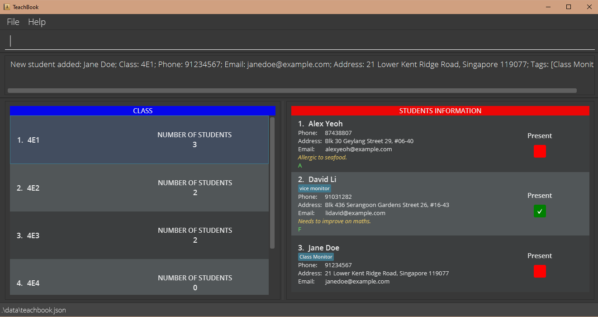
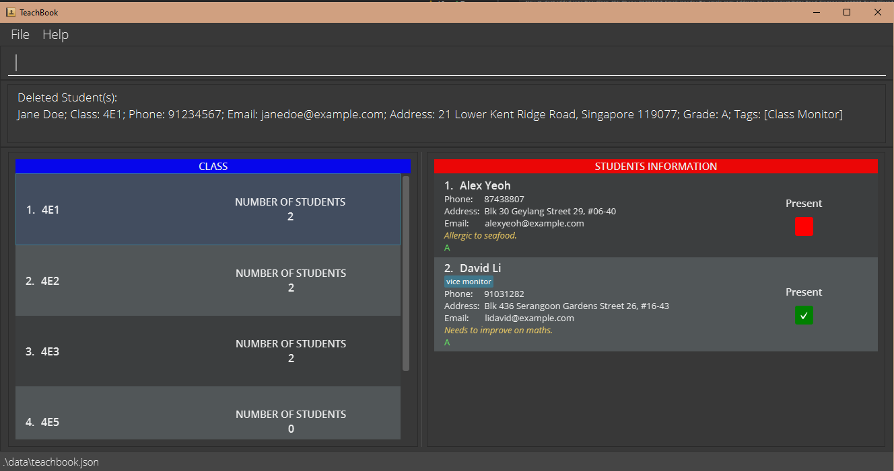
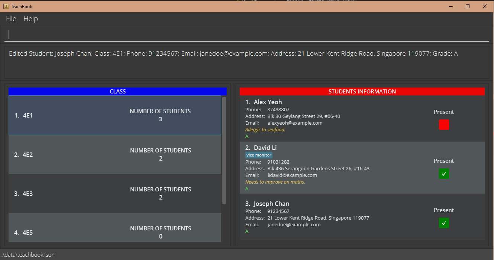
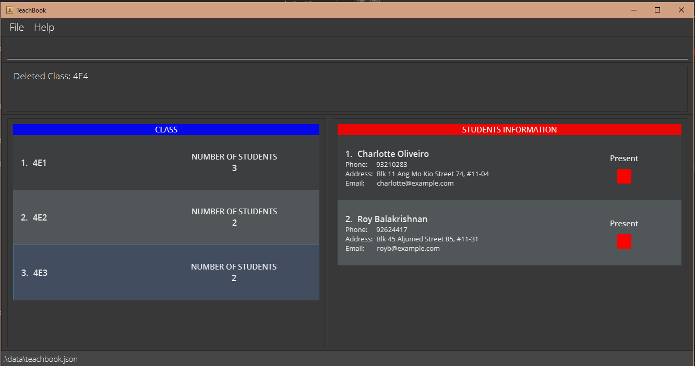
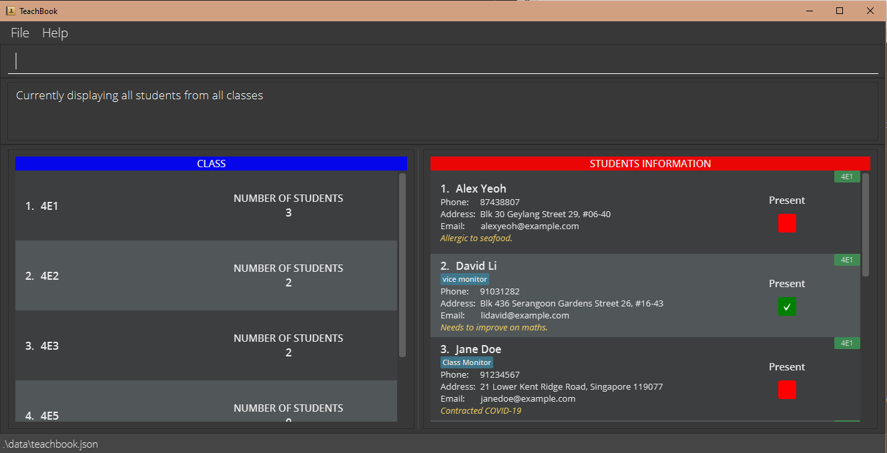
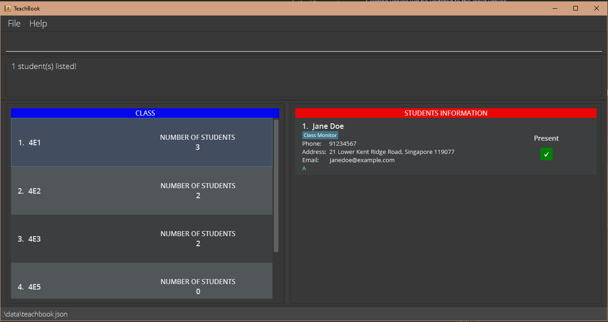

TeachBook is a **desktop app for teachers to manage student contacts, optimized for use via a Command Line Interface** (CLI) while still having the benefits of a Graphical User Interface (GUI). It is targeted towards teachers who can type fast. It allows teachers to store and organise contacts related to their students into different classes. On top of that, teachers can tag the class role of the student.

* Table of Contents
  {:toc}

--------------------------------------------------------------------------------------------------------------------

## Quick start

1. Ensure you have Java `11` or above installed in your Computer.

1. Download the latest `teachbook.jar` from here (available soon).

1. Copy the file to the folder you want to use as the _home folder_ for your TeachBook.

1. Double-click the file to start the app. The GUI similar to the below should appear in a few seconds. Note how the app contains some sample data. 
   

1. Type the command in the command box and press Enter to execute it. e.g. typing **`help`** and pressing Enter will open the help window. 
   Some example commands you can try:

   {update or delete this point}

1. Refer to the [Features](#features) below for details of each command.

--------------------------------------------------------------------------------------------------------------------

## Features

**:information_source: Notes about the command format:** 

{to be updated}

* Extraneous parameters for commands that do not take in parameters (such as `help`, `exit` and `clear`) will be ignored. 
  e.g. if the command specifies `help 123`, it will be interpreted as `help`.

### Viewing help : `help`

Shows a message explaining how to access the help page.

Format: `help`

### Adding a student : `add`

Adds a student to the TeachBook.

Format: `add n/NAME p/PHONE_NUMBER e/EMAIL a/ADDRESS [b/BLOOD_TYPE] [pc/PARENTS_CONTACT] [t/TAG1] [t/TAG2]...`

:bulb: **Tip:**
A student can have any number of tags (including 0)

* Everything is compulsory except for Blood Type, Parents Contact and Tag.
* You can add multiple tags by adding more `t/` flags.
* Student number will automatically be assigned once student is added.

Examples:
* `add n/John Doe p/91234567 e/johndoe@example.com a/21 Lower Kent Ridge Road, Singapore 119077` adds the bare minimum contact information of a student named John Doe from class A into the TeachBook.
* `add n/Jane Doe p/91234567 e/johndoe@example.com a/21 Lower Kent Ridge Road, Singapore 119077 b/AB+ pc/92349983 t/Class Monitor` adds contact information of Jane Doe with all the optional information into the TeachBook.

### Deleting a student : `delete`

Deletes the specified student from the TeachBook.

Format: `delete INDEX`

* Deletes the student at the specified `INDEX`.
* The index refers to the index number shown in the displayed student list.
* The index must be a positive integer 1, 2, 3, ...

Examples:
* `list all` followed by `delete 2` deletes the 2nd student in the TeachBook.
* `find John` followed by `delete 1` deletes the 1st student in the results of the `find` command.

### Editing a student : `edit`

Edits an existing student in the TeachBook. You can also use this command to add previously not-added information.

Format: `edit INDEX [n/NAME] [p/PHONE_NUMBER] [e/EMAIL] [a/ADDRESS] [t/TAG1] [t/TAG2]...`

* Edits the student at the specified `INDEX`.
* The index refers to the index number shown in the displayed student list.
* The index must be a positive integer 1, 2, 3, ...
* Existing values will be updated to the input values.

Examples:
* `edit 1 p/91234567 e/johndoe@example.com` edits the phone number and email address of the 1st student to be `91234567` and `johndoe@example.com` respectively.
* `edit 2 n/Joseph Chan t/` edits the name of the 2nd student to be `Joseph Chan` and clears all existing tags.

### Selecting a class : `select`

Selects the **class** to be shown by TeachBook.

Format: `select CLASSNAME`

* The `CLASSNAME` to be selected is case-sensitive and must be already inside the list. If not TeachBook will return `The class does not exist`.
* The currently selected class will be highlighted in blue as seen in the image below where class named `B` is selected.

Example:
* `select A` Selects the class named `A` from the list of classes.

### Adding a class : `addClass`

Adds a class with the specified class name to the TeachBook.

Format: `addClass CLASS_NAME`

Examples:
* `addClass example`

### Deleting a class : `deleteClass`

Deletes the specified class from the TeachBook.

Format: `deleteClass CLASS_NAME`

* Deletes the class with the specified `CLASS_NAME`

Examples:
* `deleteClass A` Deletes the class named `A` from the TeachBook.

### Editing a class : `editClass`

Edits an existing class in the TeachBook.

Format: `editClass INDEX n/CLASS_NAME`

* Edits the class at the specified `INDEX`.
* The index refers to the index number shown in the displayed class list.
* The index must be a positive integer 1, 2, 3, ...
* Existing values will be updated to the input values.

Examples:
* `edit 1 n/Ace` edits the class name of the 1st class to be `Ace`.

### Listing all students : `list`

Shows the list of all students from the currently selected class or the entire TeachBook.

Format: `list`  `list all`  `list absentee`

* `list` lists all students from the currently selected class or the entire TeachBook.
* `list all` lists all students in the TeachBook.
* `list absentee` lists all students from the currently selected class or the entire TeachBook whose status is unmarked.

:bulb: **Tip:**
`list all` clears any currently selected class. As a result, any command followed by `list all` will be operating on all students in the TeachBook.

### Locating students by name : `find`

Finds students whose name contain any of the given keywords.

Format: `find KEYWORD1 [KEYWORD2]...`

* The search is case-insensitive e.g. john, JOHN or JoHn will match John.
* The order of the keywords does not matter e.g. Doe John will match John Doe.
* Only the name is searched. {more fields to be searched}
* Only full words will be matched e.g. John will not match Johnny.
* Students matching at least one keyword will be returned (i.e. OR search). e.g. John Doe will return Jone Deer, Jane Doe.

Examples:
* `find John Doe` returns only one `John Doe` from the currently selected class, even though there is another `John Doe` from a different class.
* `list all` followed by `find John Doe` returns two `John Doe`, assuming that there are two `John Doe` in the entire the TeachBook, one from class `A` and another one from class `B`.

### Printing to Excel : `print`

Prints a student list of current selected class with customized columns.

Format: `print c/COLUMN1 [c/COLUMN2] ...`

* First Column is the names of students in currently selected class.
* Column represents column headers in the Excel file.
* Columns that requires 

Examples:
* `print c/Signature` Creates an Excel (.xls) file with a student name column and Signature column

### Clearing all entries : `clear`

Clears all classes and students from the TeachBook.

Format: `clear`

### Exiting the program : `exit`

Exits the app.

Format: `exit`

### Saving the data

* **Except for attendance data**, TeachBook data are saved in the hard disk automatically after any command that changes the data. There is no need to save manually.
* **You need to execute `print` command to save any attendance data.**

### Editing the data file

TeachBook data are saved as a JSON file `[JAR file location]/data/addressbook.json`. Advanced users are welcome to update data directly by editing that data file.

:exclamation: **Caution:**
If your changes to the data file makes its format invalid, TeachBook will discard all data and start with an empty data file at the next run.

--------------------------------------------------------------------------------------------------------------------

## FAQ

**Q**: ... 
**A**: ...

--------------------------------------------------------------------------------------------------------------------

## Command summary

Action             | Format, Examples
-------------------|------------------
**Help**           | `help`
**Add student**    | `add n/NAME p/PHONE_NUMBER e/EMAIL a/ADDRESS [b/BLOOD_TYPE] [pc/PARENTS_CONTACT] [t/TAG1] [t/TAG2]...`   e.g., `add n/John Doe p/91234567 e/johndoe@example.com a/21 Lower Kent Ridge Road, Singapore 119077 b/AB+ pc/92039923 t/class treasurer`
**Delete student** | `delete INDEX`   e.g., `delete 1`
**Edit student**   | `edit INDEX [n/NAME] [p/PHONE_NUMBER] [e/EMAIL] [a/ADDRESS] [t/TAG1] [t/TAG2]...`   e.g.,`edit 2 n/Joseph Chan t/`
**Select class**   | `select CLASS_NAME`   e.g., `select A`
**Add class**      | `addClass CLASS_NAME`   e.g., `addClass A`
**Delete class**   | `deleteClass CLASS_NAME`   e.g., `deleteClass A`
**Edit class**     | `editClass INDEX n/CLASS_NAME`   e.g., `editClass 1 n/Ace`
**List**           | `list `  `list all`  `list absentee`
**Find**           | `find KEYWORD1 [KEYWORD2]...`  e.g., `find James Jake`
**Print**          | `print c/COLUMN1 [c/COLUMN2]...`   e.g. , `print c/Signature`
**Clear**          | `clear`
**Exit**           | `exit`
